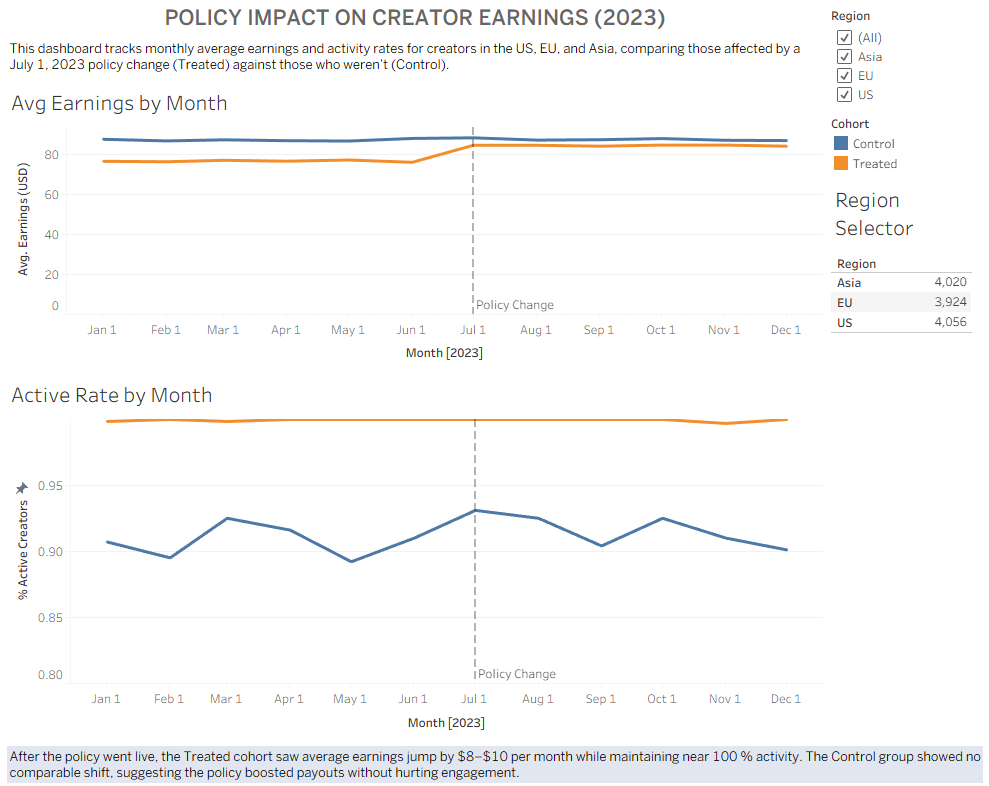

# Simulating Payout Policy Changes
### How Lowering the Minimum Payout Threshold Affects Small Creator Earnings & Retention

---

## Overview

Small creators on content platforms often wait months before hitting a payout minimum delaying income and quietly eroding motivation to keep creating. This project simulates what happens when that threshold drops from $100 to $50.

Using a **Difference-in-Differences (DiD)** causal inference framework, I estimated the policy's effect on creator earnings and activity across 1,000 simulated creators over 12 months isolating the impact of the threshold change from natural variation in earnings over time.

> **Why DiD?** A true A/B test wasn't feasible in this scenario. DiD lets us estimate causal impact using pre/post observations across treated and control groups, as long as both groups follow parallel trends before the policy kicks in.

---

## Key Findings

- The policy change produced an estimated **+$7.54/month** earnings lift for treated creators, a roughly **10% increase** over their pre-policy average of $76.49
- Treated creators maintained **near-100% activity rates** post-policy, while the control group held flat at ~90%, suggesting the threshold change improved engagement without disrupting platform behavior
- The control group's earnings barely moved ($87.02 → $87.28), confirming the effect is attributable to the policy rather than a general platform trend
- The earnings gap between groups **narrowed meaningfully** post-policy, from ~$10.50/month to ~$3.00/month — a signal that lower thresholds could help close the earnings divide between small and large creators

---

## DiD Summary Table

| Group | Pre-Policy Avg | Post-Policy Avg | Change |
|---|---|---|---|
| Treated (small creators, $50–$100) | $76.49 | $84.30 | +$7.81 |
| Control (larger creators, $100–$150) | $87.02 | $87.28 | +$0.26 |
| **DiD Estimate (Policy Effect)** | | | **+$7.54/month** |

---

## Visualization

👉 [**Tableau Public Dashboard — Policy Impact on Creator Earnings (2023)**](https://public.tableau.com/app/profile/kimberly.jarosch/viz/policy_impact_db/PolicyImpactDashboard?publish=yes)



The dashboard shows monthly average earnings and activity rates by cohort, with a marked policy change line at July 1, 2023. Region filters (US, EU, Asia) allow drill-down by geography with roughly even distribution across ~4,000 creators per region.

---

## Tools & Methods

| Layer | Tools |
|---|---|
| Data Simulation | Python — `numpy`, `pandas` |
| Causal Analysis | Difference-in-Differences (manual DiD estimate) |
| Visualization | Tableau Public, `matplotlib`, `seaborn` |
| Environment | Jupyter Notebook |

---

## Project Structure

```
├── simulate_payout_policy_FINAL.ipynb   # Data simulation + DiD analysis
├── simulated_payout_data.csv            # Exported dataset (1,000 creators × 12 months)
├── policy_impact_db.twbx                # Tableau workbook
└── README.md
```

---

## How to Reproduce

1. Run `simulate_payout_policy_FINAL.ipynb` top to bottom — it simulates data and computes the DiD estimate
2. The notebook exports `simulated_payout_data.csv` automatically
3. Open `policy_impact_db.twbx` in Tableau Desktop and reconnect to the exported CSV if prompted

---

## Conclusion & Business Implications

Lowering the payout threshold produced a measurable earnings increase for small creators with no detectable drop in activity. For a product or payments team, this suggests:

- **Earlier payouts can improve creator retention** without meaningfully increasing risk or cost
- The effect appears consistent across regions, which supports a global rollout rather than a targeted pilot
- The model could be extended with real churn data to quantify the retention impact more precisely

---

## What I'd Improve Next

- Add a formal **parallel trends validation** plot (pre-policy period only) to strengthen the DiD assumption
- Run a **regression-based DiD** (`earnings ~ treated × post + controls`) for a more rigorous estimate with confidence intervals
- Simulate **heterogeneous treatment effects** by region or creator tenure to identify where the policy has the most impact
- Incorporate a real churn model to quantify retention value, not just earnings lift
